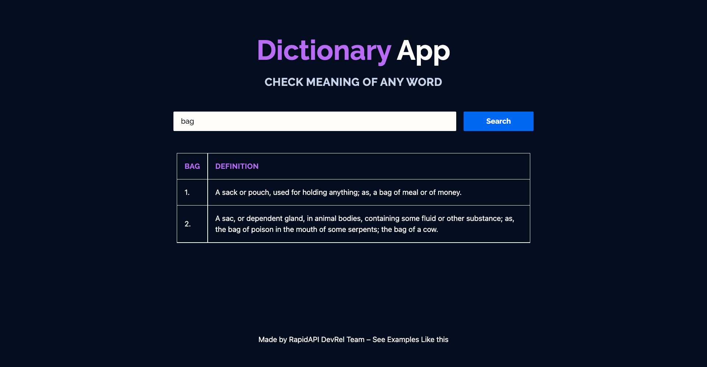

<div align="center">
	<h2>Dictionary App</h2>
</div>

> [Live Preview](https://rapidapi-example-dictionary-app.vercel.app/)

### ⚡️ Features

- Get meaning of any word
- Mobile friendly

## 📖 Guide

[_Read how we build this application_](https://rapidapi.com/guides/build-dictionary-app)

### 🛠️ Installation Steps

Install dependencies

```bash
npm install
```

then just run command in terminal:

npm run dev

You are all set! Open [localhost:3000](http://localhost:3000/) to see the app.
